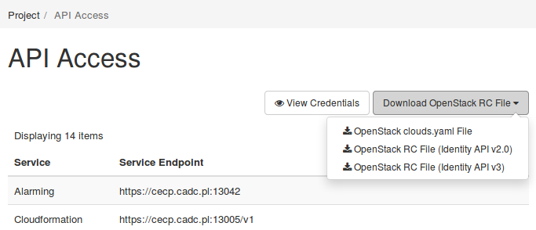

# Install CLI clients

Available through Python's PyPI or distribution packages (yum/apt)
## Install main OpenStack client 
via pip:
```# pip install python-openstackclient```
via yum:
```# yum install python-openstackclient```
via apt:
```# apt install python-openstackclient```

## Get project credentials

You can download credential file from dashboard:


```clouds.yaml``` - for good for multi-cloud/multi-project scenarios, if you are using multiple cloud OS_CLOUD variable needs to be set
```RC files v2/v3``` - v3 recommended

## Use help - alawys
```
$ openstack help
$ openstack help server 
Command "server" matches:
  server add fixed ip
  server add floating ip
  server add port
  server add security group
  server add volume
  server backup create
  server create
  server delete
  server dump create
  server event list
  server event show
  ...
  $ openstack help server create
usage: openstack server create [-h] [-f {json,shell,table,value,yaml}]
                               [-c COLUMN] [--max-width <integer>]
                               [--fit-width] [--print-empty] [--noindent]
                               [--prefix PREFIX]
...
```