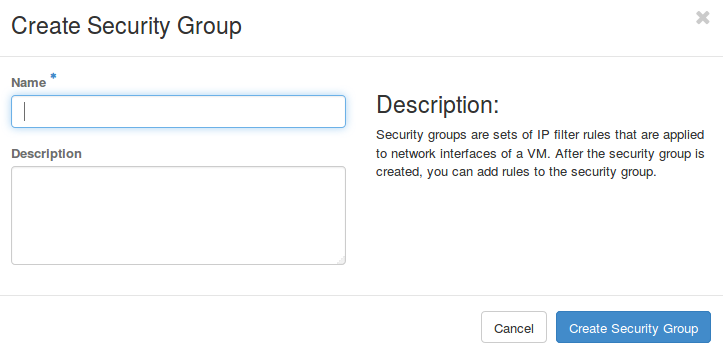

# Security groups & LB
## Security groups

Security groups are sets of IP filter rules that are applied to all project instances, which define networking access to the instance. Group rules are project specific; project members can edit the default rules for their group and add new rule sets.

All projects have a ```default``` security group which is applied to any instance that has no other defined security group. Unless you change the default, this security group denies all incoming traffic and allows only outgoing traffic to your instance.


### Security groups creation



### Security groups creation

```Manage rules -> Add Rule```


You can choose from one of predefined rules


or create one that fits the flow you need.


Remote: Security Group
Selecting a security group as the source will allow any other instance in that security group access to any other instance via this rule.

For example:
```
$ openstack security group rule create cluster \
    --remote-group global_http --protocol tcp --dst-port 22:22
```
The ```cluster``` rule allows SSH access from any other instance that uses the ```global_http``` group.

## Load Balancer

**No GUI for Load Balancer. CLI and API only**

- Create LB:

```
$ neutron lbaas-loadbalancer-create --name lb1 10.0.0.0/24   
Created a new loadbalancer:
+---------------------+--------------------------------------+
| Field               | Value                                |
+---------------------+--------------------------------------+
| admin_state_up      | True                                 |
| description         |                                      |
| id                  | a4e17224-a29d-496f-90e2-ed5779957b40 |
| listeners           |                                      |
| name                | lb1                                  |
| operating_status    | OFFLINE                              |
| pools               |                                      |
| provider            | haproxy                              |
| provisioning_status | PENDING_CREATE                       |
| tenant_id           | f464b37c585c4f6a9231f32eee03c2e5     |
| vip_address         | 10.0.0.11                            |
| vip_port_id         | 79ea32d9-f7c8-4d16-9851-5f889167a2ec |
| vip_subnet_id       | 1a5a99ac-2ff7-4450-adf9-b88733d1ce2c |
+---------------------+--------------------------------------+
$ neutron lbaas-loadbalancer-show lb1
+---------------------+--------------------------------------+
| Field               | Value                                |
+---------------------+--------------------------------------+
| admin_state_up      | True                                 |
| description         |                                      |
| id                  | a4e17224-a29d-496f-90e2-ed5779957b40 |
| listeners           |                                      |
| name                | lb1                                  |
| operating_status    | ONLINE                               |
| pools               |                                      |
| provider            | haproxy                              |
| provisioning_status | ACTIVE                               |
| tenant_id           | f464b37c585c4f6a9231f32eee03c2e5     |
| vip_address         | 10.0.0.11                            |
| vip_port_id         | 79ea32d9-f7c8-4d16-9851-5f889167a2ec |
| vip_subnet_id       | 1a5a99ac-2ff7-4450-adf9-b88733d1ce2c |
+---------------------+--------------------------------------+

```

- Create sec-group

```
$ neutron security-group-create lbaas
$ neutron security-group-rule-create \
  --direction ingress \
  --protocol tcp \
  --port-range-min 80 \
  --port-range-max 80 \
  --remote-ip-prefix 0.0.0.0/0 \
  lbaas
$ neutron security-group-rule-create \
  --direction ingress \
  --protocol tcp \
  --port-range-min 443 \
  --port-range-max 443 \
  --remote-ip-prefix 0.0.0.0/0 \
  lbaas
$ neutron security-group-rule-create \
  --direction ingress \
  --protocol icmp \
  lbaas
```

- Assign sec-group to LB-port

```
$ neutron port-update \
  --security-group lbaas \
79ea32d9-f7c8-4d16-9851-5f889167a2ec
Updated port: 79ea32d9-f7c8-4d16-9851-5f889167a2ec
```

- Create LB listeners

```
$ neutron lbaas-listener-create \
>   --name test-lb-http \
>   --loadbalancer lb1 \
>   --protocol HTTP \
>   --protocol-port 80
neutron CLI is deprecated and will be removed in the future. Use openstack CLI instead.
Created a new listener:
+---------------------------+------------------------------------------------+
| Field                     | Value                                          |
+---------------------------+------------------------------------------------+
| admin_state_up            | True                                           |
| connection_limit          | -1                                             |
| default_pool_id           |                                                |
| default_tls_container_ref |                                                |
| description               |                                                |
| id                        | 1580a2d6-e5bf-4083-8459-7050681bd5e1           |
| loadbalancers             | {"id": "58f585a8-78a1-403c-9222-ab22e4334186"} |
| name                      | test-lb-http                                   |
| protocol                  | HTTP                                           |
| protocol_port             | 80                                             |
| sni_container_refs        |                                                |
| tenant_id                 | f464b37c585c4f6a9231f32eee03c2e5               |
+---------------------------+------------------------------------------------+
```

- Create LB pool

```
$ neutron lbaas-pool-create \
>   --name test-lb-pool-http \
>   --lb-algorithm ROUND_ROBIN \
>   --listener test-lb-http \
>   --protocol HTTP
neutron CLI is deprecated and will be removed in the future. Use openstack CLI instead.
Created a new pool:
+---------------------+------------------------------------------------+
| Field               | Value                                          |
+---------------------+------------------------------------------------+
| admin_state_up      | True                                           |
| description         |                                                |
| healthmonitor_id    |                                                |
| id                  | b7fc21be-1faa-4dbd-9f58-b21497945c17           |
| lb_algorithm        | ROUND_ROBIN                                    |
| listeners           | {"id": "1580a2d6-e5bf-4083-8459-7050681bd5e1"} |
| loadbalancers       | {"id": "58f585a8-78a1-403c-9222-ab22e4334186"} |
| members             |                                                |
| name                | test-lb-pool-http                              |
| protocol            | HTTP                                           |
| session_persistence |                                                |
| tenant_id           | f464b37c585c4f6a9231f32eee03c2e5               |
+---------------------+------------------------------------------------+
```

- Add members to LB:

```
$ nova list
+--------------------------------------+-----------+--------+------------+-------------+------------------------------------+
| ID                                   | Name      | Status | Task State | Power State | Networks                           |
+--------------------------------------+-----------+--------+------------+-------------+------------------------------------+
| 2ae2eb47-717b-4d74-9b92-9bf7553368c0 | lb-test-1 | ACTIVE | -          | Running     | 10.0.0.0/24=10.0.0.8               |
| 4825ddbc-390b-4368-90b7-966cb84ab77c | lb-test-2 | ACTIVE | -          | Running     | 10.0.0.0/24=10.0.0.16              |
+--------------------------------------+-----------+--------+------------+-------------+------------------------------------+
```
```
$ neutron lbaas-member-create \
>   --subnet 10.0.0.0/24 \
>   --address 10.0.0.8 \
>   --protocol-port 80 \
>   test-lb-pool-http
neutron CLI is deprecated and will be removed in the future. Use openstack CLI instead.
Created a new member:
+----------------+--------------------------------------+
| Field          | Value                                |
+----------------+--------------------------------------+
| address        | 10.0.0.8                             |
| admin_state_up | True                                 |
| id             | 138cd873-fdd2-428a-8589-d60c4e1a696f |
| name           |                                      |
| protocol_port  | 80                                   |
| subnet_id      | 1a5a99ac-2ff7-4450-adf9-b88733d1ce2c |
| tenant_id      | f464b37c585c4f6a9231f32eee03c2e5     |
| weight         | 1                                    |
+----------------+--------------------------------------+
```
```
$ neutron lbaas-member-create \
>   --subnet 10.0.0.0/24 \
>   --address 10.0.0.16 \
>   --protocol-port 80 \
>   test-lb-pool-http
neutron CLI is deprecated and will be removed in the future. Use openstack CLI instead.
Created a new member:
+----------------+--------------------------------------+
| Field          | Value                                |
+----------------+--------------------------------------+
| address        | 10.0.0.16                            |
| admin_state_up | True                                 |
| id             | 68f7f5d5-2127-41b8-8a5f-4410dc4a50f1 |
| name           |                                      |
| protocol_port  | 80                                   |
| subnet_id      | 1a5a99ac-2ff7-4450-adf9-b88733d1ce2c |
| tenant_id      | f464b37c585c4f6a9231f32eee03c2e5     |
| weight         | 1                                    |
+----------------+--------------------------------------+
```


