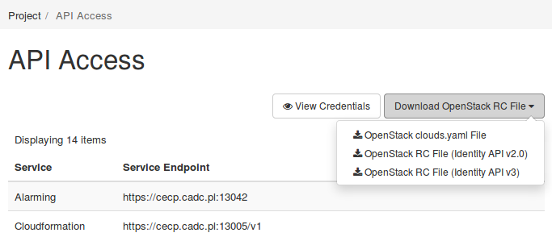

IaaS Enterprise Platform
===
## Advanced

###### Krzysztof Szałkowski
###### Szymon Rymarz
###### Piotr Kopeć
---
Agenda
===

1. [CLI](./advanced/cli.md)
2. [Tworzenie obrazów](./advanced/images.md)
3. [Firewall & LB](./advanced/firewall.md)
4. [Scheduling](./advanced/scheduling.md)
5. [Moduł orkiestracji](./advanced/orchestration.md)

---

# Install CLI clients

Available through Python's PyPI or distribution packages (yum/apt)
## Install main OpenStack client 
via pip:
```# pip install python-openstackclient```
via yum:
```# yum install python-openstackclient```
via apt:
```# apt install python-openstackclient```

---
## Get project credentials

You can download credential file from dashboard:


---
```clouds.yaml``` - for good for multi-cloud/multi-project scenarios, if you are using multiple cloud OS_CLOUD variable needs to be set
```RC files v2/v3``` - v3 recommended

---
## Use help - alawys
```
$ openstack help
$ openstack help server 
Command "server" matches:
  server add fixed ip
  server add floating ip
  server add port
  server add security group
  server add volume
  server backup create
  server create
  server delete
  server dump create
  server event list
  server event show
```

---
```
  $ openstack help server create
usage: openstack server create [-h] [-f {json,shell,table,value,yaml}]
                               [-c COLUMN] [--max-width <integer>]
                               [--fit-width] [--print-empty] [--noindent]
                               [--prefix PREFIX]
...
```

---
# Images
## Use well prepared images as templates if you need a customized image
Get images:

- CentOS 6 - http://cloud.centos.org/centos/6/images/
- CentOS 7 - http://cloud.centos.org/centos/7/images/
- Ubuntu - http://cloud-images.ubuntu.com/trusty/current/
- Debian - http://cdimage.debian.org/cdimage/openstack/
- Fedora - https://alt.fedoraproject.org/cloud/
- Red Hat 6&7 – requires access to RHN.

---
## Image modifications
```guestfish```- The guestfish program is a tool from the libguestfs project that allows you to modify the files inside of a virtual machine image.

---
### Example:

Assume that you have a CentOS qcow2 image called centos63_desktop.img.
```
# guestfish -i --network -a centos63_desktop.img

Welcome to guestfish, the libguestfs filesystem interactive shell for
editing virtual machine filesystems.

Type: 'help' for help on commands
'man' to read the manual
'quit' to quit the shell

><fs>
```
---

Install the mariadb:
```><fs> command "yum -y install mariadb mariadb-server"```
Enable the mariadb server:
```><fs> command "systemctl enable mariadb"```


Doing modifications remember about security features such as SELinux.

---

### You can also get modified image using snpashot:

```
CentOS 7 img ---- create vm ----->
 CentOS 7 VM ----- do stuff ---- and create snapshot ---->
 Modified CentOS 7 img --- create vm ----> ...
```

---

## Convert between image formats
The ```qemu-img convert``` command can do conversion between multiple formats, including qcow2, qed, raw, vdi, vhd, and vmdk.

Run the following command to convert a vmdk image file to a raw image file.
```
$ qemu-img convert -f vmdk -O raw image.vmdk image.img
```

**Note**: This will only convert image format, it will not preparte image. You need to do this manually [Detailed requiremetns](https://docs.openstack.org/image-guide/openstack-images.html)

---
You can also use VirtualBox images after converting them to raw format:
```$ VBoxManage clonehd ~/VirtualBox\ VMs/image.vdi image.img --format raw```

---

## Use Image Requirements
To enforce constraints on VM flavor:
`

---

# Security groups

Security groups are sets of IP filter rules that are applied to all project instances, which define networking access to the instance. Group rules are project specific; project members can edit the default rules for their group and add new rule sets.

All projects have a ```default``` security group which is applied to any instance that has no other defined security group. Unless you change the default, this security group denies all incoming traffic and allows only outgoing traffic to your instance.

---


---
### Security groups creation


---
### Security groups creation

```Manage rules -> Add Rule```

---
#### You can choose from one of predefined rules


---

#### or create one that fits the flow you need.


---

##### Remote: Security Group
Selecting a security group as the source will allow any other instance in that security group access to any other instance via this rule.

For example:
```
$ openstack security group rule create cluster \
    --remote-group global_http --protocol tcp --dst-port 22:22
```
The ```cluster``` rule allows SSH access from any other instance that uses the ```global_http``` group.

---

# Load Balancer

**No GUI for Load Balancer. CLI and API only**

---

## Create LB:

```
$ neutron lbaas-loadbalancer-create --name lb1 10.0.0.0/24   
Created a new loadbalancer:
+---------------------+--------------------------------------+
| Field               | Value                                |
+---------------------+--------------------------------------+
| admin_state_up      | True                                 |
| description         |                                      |
| id                  | a4e17224-a29d-496f-90e2-ed5779957b40 |
| listeners           |                                      |
| name                | lb1                                  |
| operating_status    | OFFLINE                              |
| pools               |                                      |
| provider            | haproxy                              |
| provisioning_status | PENDING_CREATE                       |
| tenant_id           | f464b37c585c4f6a9231f32eee03c2e5     |
| vip_address         | 10.0.0.11                            |
| vip_port_id         | 79ea32d9-f7c8-4d16-9851-5f889167a2ec |
| vip_subnet_id       | 1a5a99ac-2ff7-4450-adf9-b88733d1ce2c |
+---------------------+--------------------------------------+
```
---
```
$ neutron lbaas-loadbalancer-show lb1
+---------------------+--------------------------------------+
| Field               | Value                                |
+---------------------+--------------------------------------+
| admin_state_up      | True                                 |
| description         |                                      |
| id                  | a4e17224-a29d-496f-90e2-ed5779957b40 |
| listeners           |                                      |
| name                | lb1                                  |
| operating_status    | ONLINE                               |
| pools               |                                      |
| provider            | haproxy                              |
| provisioning_status | ACTIVE                               |
| tenant_id           | f464b37c585c4f6a9231f32eee03c2e5     |
| vip_address         | 10.0.0.11                            |
| vip_port_id         | 79ea32d9-f7c8-4d16-9851-5f889167a2ec |
| vip_subnet_id       | 1a5a99ac-2ff7-4450-adf9-b88733d1ce2c |
+---------------------+--------------------------------------+

```

---
## Create sec-group

```
$ neutron security-group-create lbaas
$ neutron security-group-rule-create \
  --direction ingress \
  --protocol tcp \
  --port-range-min 80 \
  --port-range-max 80 \
  --remote-ip-prefix 0.0.0.0/0 \
  lbaas
$ neutron security-group-rule-create \
  --direction ingress \
  --protocol tcp \
  --port-range-min 443 \
  --port-range-max 443 \
  --remote-ip-prefix 0.0.0.0/0 \
  lbaas
$ neutron security-group-rule-create \
  --direction ingress \
  --protocol icmp \
  lbaas
```
---

## Assign sec-group to LB-port

```
$ neutron port-update \
  --security-group lbaas \
79ea32d9-f7c8-4d16-9851-5f889167a2ec
Updated port: 79ea32d9-f7c8-4d16-9851-5f889167a2ec
```
---

## Create LB listeners

```
$ neutron lbaas-listener-create \
>   --name test-lb-http \
>   --loadbalancer lb1 \
>   --protocol HTTP \
>   --protocol-port 80
neutron CLI is deprecated and will be removed in the future. Use openstack CLI instead.
Created a new listener:
+---------------------------+------------------------------------------------+
| Field                     | Value                                          |
+---------------------------+------------------------------------------------+
| admin_state_up            | True                                           |
| connection_limit          | -1                                             |
| default_pool_id           |                                                |
| default_tls_container_ref |                                                |
| description               |                                                |
| id                        | 1580a2d6-e5bf-4083-8459-7050681bd5e1           |
| loadbalancers             | {"id": "58f585a8-78a1-403c-9222-ab22e4334186"} |
| name                      | test-lb-http                                   |
| protocol                  | HTTP                                           |
| protocol_port             | 80                                             |
| sni_container_refs        |                                                |
| tenant_id                 | f464b37c585c4f6a9231f32eee03c2e5               |
+---------------------------+------------------------------------------------+
```
---

## Create LB pool

```
$ neutron lbaas-pool-create \
>   --name test-lb-pool-http \
>   --lb-algorithm ROUND_ROBIN \
>   --listener test-lb-http \
>   --protocol HTTP
neutron CLI is deprecated and will be removed in the future. Use openstack CLI instead.
Created a new pool:
+---------------------+------------------------------------------------+
| Field               | Value                                          |
+---------------------+------------------------------------------------+
| admin_state_up      | True                                           |
| description         |                                                |
| healthmonitor_id    |                                                |
| id                  | b7fc21be-1faa-4dbd-9f58-b21497945c17           |
| lb_algorithm        | ROUND_ROBIN                                    |
| listeners           | {"id": "1580a2d6-e5bf-4083-8459-7050681bd5e1"} |
| loadbalancers       | {"id": "58f585a8-78a1-403c-9222-ab22e4334186"} |
| members             |                                                |
| name                | test-lb-pool-http                              |
| protocol            | HTTP                                           |
| session_persistence |                                                |
| tenant_id           | f464b37c585c4f6a9231f32eee03c2e5               |
+---------------------+------------------------------------------------+
```
---

## Add members to LB:

```
$ nova list
+--------------------------------------+-----------+--------+------------+-------------+------------------------------------+
| ID                                   | Name      | Status | Task State | Power State | Networks                           |
+--------------------------------------+-----------+--------+------------+-------------+------------------------------------+
| 2ae2eb47-717b-4d74-9b92-9bf7553368c0 | lb-test-1 | ACTIVE | -          | Running     | 10.0.0.0/24=10.0.0.8               |
| 4825ddbc-390b-4368-90b7-966cb84ab77c | lb-test-2 | ACTIVE | -          | Running     | 10.0.0.0/24=10.0.0.16              |
+--------------------------------------+-----------+--------+------------+-------------+------------------------------------+
```
---

```
$ neutron lbaas-member-create \
>   --subnet 10.0.0.0/24 \
>   --address 10.0.0.8 \
>   --protocol-port 80 \
>   test-lb-pool-http
neutron CLI is deprecated and will be removed in the future. Use openstack CLI instead.
Created a new member:
+----------------+--------------------------------------+
| Field          | Value                                |
+----------------+--------------------------------------+
| address        | 10.0.0.8                             |
| admin_state_up | True                                 |
| id             | 138cd873-fdd2-428a-8589-d60c4e1a696f |
| name           |                                      |
| protocol_port  | 80                                   |
| subnet_id      | 1a5a99ac-2ff7-4450-adf9-b88733d1ce2c |
| tenant_id      | f464b37c585c4f6a9231f32eee03c2e5     |
| weight         | 1                                    |
+----------------+--------------------------------------+
```
---
```
$ neutron lbaas-member-create \
>   --subnet 10.0.0.0/24 \
>   --address 10.0.0.16 \
>   --protocol-port 80 \
>   test-lb-pool-http
neutron CLI is deprecated and will be removed in the future. Use openstack CLI instead.
Created a new member:
+----------------+--------------------------------------+
| Field          | Value                                |
+----------------+--------------------------------------+
| address        | 10.0.0.16                            |
| admin_state_up | True                                 |
| id             | 68f7f5d5-2127-41b8-8a5f-4410dc4a50f1 |
| name           |                                      |
| protocol_port  | 80                                   |
| subnet_id      | 1a5a99ac-2ff7-4450-adf9-b88733d1ce2c |
| tenant_id      | f464b37c585c4f6a9231f32eee03c2e5     |
| weight         | 1                                    |
+----------------+--------------------------------------+
```
---


# Scheduling
There are ways to affect cloud's scheduling process to fullfil various requirements (eg. availability or performance )

---

## Server groups

Server groups define collections of VM's so that the entire collection can be given specific properties. For example, the policy of a server group may specify that VM's in this group should not be placed on the same physical hardware due to availability requirements.

Server groups are project-specific and cannot be shared across projects.

---

### Create server group
Use CLI:

```
$ openstack server group create -h
usage: openstack server group create [-h] [-f {json,shell,table,value,yaml}]
                                     [-c COLUMN] [--max-width <integer>]
                                     [--fit-width] [--print-empty]
                                     [--noindent] [--prefix PREFIX]
                                     [--policy <policy>]
                                     <name>

Create a new server group.

positional arguments:
  <name>                New server group name

optional arguments:
  -h, --help            show this help message and exit
  --policy <policy>     Add a policy to <name> ('affinity' or 'anti-affinity',
                        default to 'affinity')
```
---

### ```affinity``` -> same host

```
$ openstack server group create \
> --policy affinity \
> scaleup_app_siteA
+----------+--------------------------------------+
| Field    | Value                                |
+----------+--------------------------------------+
| id       | 05cab439-7737-4357-b27a-91e9e14690f4 |
| members  |                                      |
| name     | scaleup_app_siteA                    |
| policies | affinity                             |
+----------+--------------------------------------+
```
---

### ```anti-affinity``` -> different host

```
$ openstack server group create \
> --policy anti-affinity \
> web_servers 
+----------+--------------------------------------+
| Field    | Value                                |
+----------+--------------------------------------+
| id       | 449c76ea-c009-4fe5-af04-89d73cfb0c0a |
| members  |                                      |
| name     | web_servers                          |
| policies | anti-affinity                        |
+----------+--------------------------------------+
```
---

# Orchestration

Heat is a service to orchestrate composite cloud applications using a declarative template format through an OpenStack-native REST API.

---
## Heat - overview

- **Heat** provides a template based orchestration for describing a cloud application by executing appropriate OpenStack API calls to generate running cloud applications.
- A **Heat** template describes the infrastructure for a cloud application in text files which are readable and writable by humans, and can be managed by version control tools.
- **Templates** specify the relationships between resources 
- The software integrates **other** components of OpenStack. 
- Heat **primarily** manages **infrastructure**, but the **templates integrate** well with software **configuration management tools** such as Puppet and Ansible.
- **Compatible with AWS CFT** - you can import definitions of your infrastructure to Heat
---


## More resources:
- [Tempalte Guide](https://docs.openstack.org/heat/latest/template_guide/index.html)
- [Example templates](https://docs.openstack.org/heat/latest/templates/index.html)
- [API Reference](https://developer.openstack.org/api-ref/orchestration/v1/)
- [Python Heat client](https://docs.openstack.org/python-heatclient/latest/s)