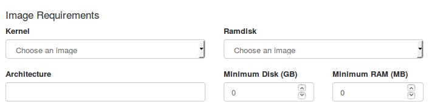

# Images
## Use well prepared images as templates if you need a customized image
Get images:

- CentOS 6 - http://cloud.centos.org/centos/6/images/
- CentOS 7 - http://cloud.centos.org/centos/7/images/
- Ubuntu - http://cloud-images.ubuntu.com/trusty/current/
- Debian - http://cdimage.debian.org/cdimage/openstack/
- Fedora - https://alt.fedoraproject.org/cloud/
- Red Hat 6&7 – requires access to RHN.

## Image modifications
```guestfish```- The guestfish program is a tool from the libguestfs project that allows you to modify the files inside of a virtual machine image.
### Example:

Assume that you have a CentOS qcow2 image called centos63_desktop.img.
```
# guestfish -i --network -a centos63_desktop.img

Welcome to guestfish, the libguestfs filesystem interactive shell for
editing virtual machine filesystems.

Type: 'help' for help on commands
'man' to read the manual
'quit' to quit the shell

><fs>
```
Install the mariadb:
```><fs> command "yum -y install mariadb mariadb-server"```
Enable the mariadb server:
```><fs> command "systemctl enable mariadb"```

Doing modifications remember about security features such as SELinux.

You can also get modified image using snpashot:

```CentOS 7 img ---- create vm -----> CentOS 7 VM ----- do stuff ---- and create snapshot ----> Modified CentOS 7 img --- create vm ----> ...```

## Convert between image formats
The ```qemu-img convert``` command can do conversion between multiple formats, including qcow2, qed, raw, vdi, vhd, and vmdk.

Run the following command to convert a vmdk image file to a raw image file.
```
$ qemu-img convert -f vmdk -O raw image.vmdk image.img
```

**Note**: This will only convert image format, it will not preparte image. You need to do this manually [Detailed requiremetns](https://docs.openstack.org/image-guide/openstack-images.html)

You can also use VirtualBox images after converting them to raw format:
```$ VBoxManage clonehd ~/VirtualBox\ VMs/image.vdi image.img --format raw```

## Use Image Requirements
To enforce constraints on VM flavor:
`


